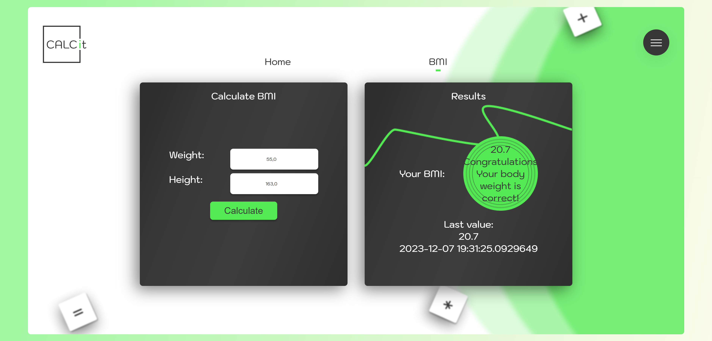
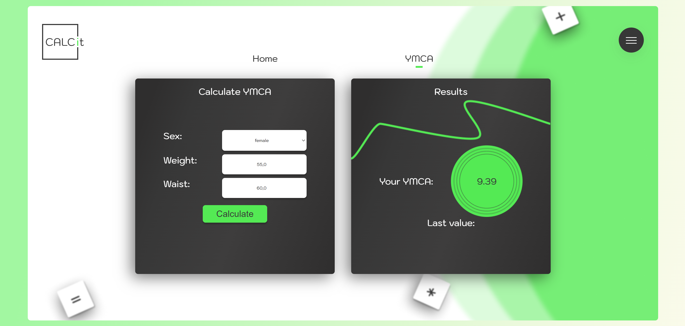
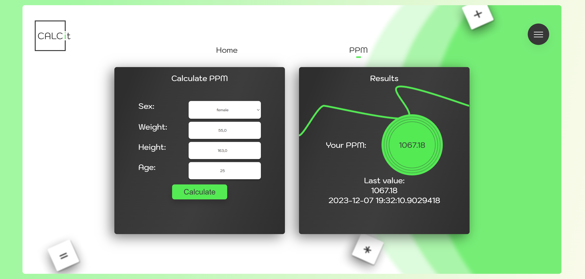
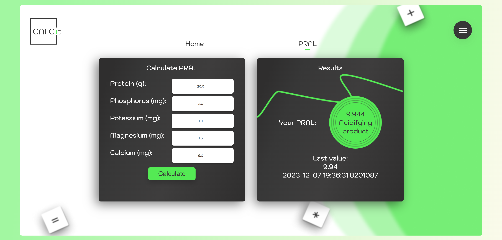
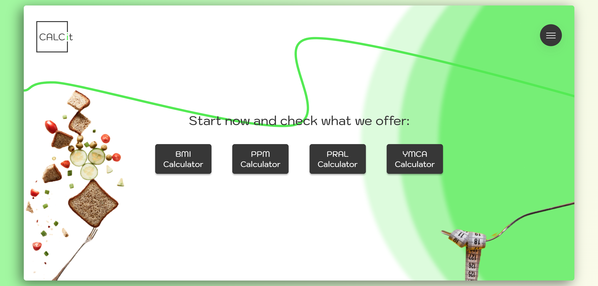

# Calcit - Fitness Calculator

Calcit is a web application that enables users to calculate various health-related metrics, including BMI, YMCA, PPM, and PRAL.
 

## Features

- *BMI Calculator:* Calculate Body Mass Index (BMI) based on weight and height.
 
- *YMCA Calculator:* Estimate abdominal obesity risk using the YMCA formula.
  
- *PPM Calculator:* Calculate Basal Metabolic Rate (BMR) using the Harris-Benedict equation.
  
- *PRAL Calculator:* Calculate Potential Renal Acid Load (PRAL) based on dietary intake.
  
	
## Installation

1. Clone the repository:
```bash git clone https://github.com/KingaP00/BMICalculators ```

## Usage
Create an account 
 
and log in

Next choose the calculator you want to use from the navigation menu.

Enter the required input values.
Click the "Calculate" button.
View the results on the screen.

## Technologies Used
- Java
- Spring Boot
- Thymeleaf
- HTML, CSS

## License
This project is licensed under the MIT License - see more  in https://opensource.org/license/mit/
